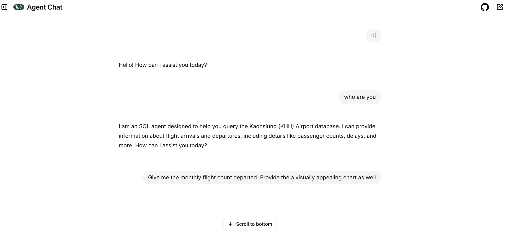

# 🛫 LangGraph Airport AI Agent Swarm

A sophisticated multi-agent system built with [LangGraph](https://langchain-ai.github.io/langgraph/) for analyzing Kaohsiung Airport data. This AI-powered system combines SQL search capabilities with data visualization through coordinated agent handoffs.

## 🌟 Features

- **🤖 Multi-Agent Architecture**: Coordinated SQL and visualization agents using LangGraph Swarm
- **📊 Intelligent Data Analysis**: Natural language to SQL query conversion with context-aware search
- **📈 Dynamic Visualizations**: Automatic plot generation using Plotly with S3 storage
- **💬 Conversational Interface**: Chat-based interaction via agent-chat-ui
- **🔄 Agent Handoffs**: Seamless transitions between data retrieval and visualization tasks
- **☁️ Cloud Storage**: Automatic CSV/HTML export and upload to AWS S3
- **🔍 Smart Mapping**: Airport and airline code lookups with Chinese language support

## 🏗️ Architecture

```
┌─────────────────────────────────────────┐
│         LangGraph Swarm Router          │
│    (Intelligent Agent Orchestration)    │
└──────────────┬──────────────────────────┘
               │
       ┌───────┴───────┐
       │               │
┌──────▼─────┐  ┌─────▼──────┐
│ SQL Agent  │  │ Plot Agent │
│            │  │            │
│ • Query DB │  │ • Plotly   │
│ • Export   │  │ • Seaborn  │
│ • S3 CSV   │  │ • S3 HTML  │
└────────────┘  └────────────┘
       │               │
       └───────┬───────┘
               │
        ┌──────▼──────┐
        │  Airport DB │
        │  (SQLite)   │
        └─────────────┘
```

## 📋 Prerequisites

Before you begin, ensure you have:

- **Python 3.11+** installed
- **OpenAI API Key** (for GPT-4o-mini)
- **AWS Account** with S3 access (for file storage)
- **Git** installed
- **(Optional)** LangSmith account for tracing

## 🚀 Setup Process

### Step 0: Configure Environment Variables

First, copy the example environment file and fill in your credentials:

```bash
# Copy the example file
cp .env.example .env
```

Now edit the `.env` file with your actual values:

```bash
# Required: OpenAI API Key
OPENAI_API_KEY=sk-proj-xxxxxxxxxxxxx

# Optional but Recommended: LangSmith (for monitoring)
LANGSMITH_API_KEY=lsv2_pt_xxxxxxxxxxxxx
LANGCHAIN_TRACING_V2=true
LANGCHAIN_PROJECT=airport-agent-swarm

# Required: Database Path
SQL_DATABASE_PATH=database/airport_data.db

# Required: AWS S3 Configuration
AWS_ACCESS_KEY_ID=AKIAXXXXXXXXXXXXX
AWS_SECRET_ACCESS_KEY=xxxxxxxxxxxxxxxxxxxxxxxxxxxxx
AWS_REGION=ap-northeast-1
S3_BUCKET_NAME=your-bucket-name
```

**🔐 Security Note**: Never commit your `.env` file to version control!

### Step 1: Install Dependencies

This project uses `uv` for fast, reliable Python package installation.

#### 1.1 Install uv Package Manager

```bash
pip install uv
```

**Why uv?** 
- ⚡ 10-100x faster than pip
- 🎯 Better dependency resolution
- 🔒 More reliable installs

#### 1.2 Install Project Dependencies

```bash
uv pip install -r requirements.txt
```

This will install:
- **LangChain** ecosystem (langchain, langchain-openai, langchain-community)
- **LangGraph** (v0.2.0+) with CLI tools
- **LangGraph Swarm** for agent coordination
- Database tools (SQLite, Pandas, SQLAlchemy)
- Visualization libraries (Plotly, Matplotlib, Seaborn)
- Web framework (FastAPI, Uvicorn)
- AWS SDK (boto3)

### Step 2: Run LangGraph CLI

#### 2.1 Start the LangGraph Server

```bash
langgraph up
```

**What this does:**
- 🚀 Starts the LangGraph server on `http://localhost:2024`
- 🔧 Automatically configures PostgreSQL checkpointer
- 📊 Exposes your agent swarm as a REST API
- 🔄 Enables hot-reloading for development

**Expected output:**
```
✓ LangGraph server started successfully
✓ Graph compiled: agent
⚡ Ready at http://localhost:2024
```

**Common Ports:**
- **2024**: LangGraph API server
- **5432**: PostgreSQL (for checkpointing)

#### 2.2 Configure Agent Chat UI

Once the server is running, connect it to the visual chat interface:

1. **Open Agent Chat UI**: Navigate to [https://agentchat.vercel.app/](https://agentchat.vercel.app/)

2. **Configure Connection Settings**:
   ```
   API URL: http://localhost:2024
   Graph ID: agent
   ```

3. **Start Chatting**: The interface will display agent handoffs and tool calls in real-time!




## 🎯 Usage Examples

Once connected to Agent Chat UI, try these queries:

### Data Retrieval
```
User: Search all the flights that departed to Japan Tokyo
Agent: [Uses SQL Agent] → Returns flight data → Offers CSV export
```

### Visualization
```
User: Give me a plot that shows the trend of flight count for Eva Airline
Agent: [SQL Agent] → [Handoff to Plot Agent] → Returns interactive Plotly chart
```

### Combined Tasks
```
User: Analyze the on time rate for China Airline in the past 3 month and provide a plot.
Agent: [SQL Agent] Retrieves data → [Plot Agent] Creates chart → Returns both data and visualization
```

## 📁 Project Structure

```
langgraph_data_swarm/
├── agents/
│   ├── llm_model.py              # OpenAI LLM configuration
│   ├── sql_search_agent/
│   │   ├── sql_agent.py          # SQL query agent with tools
│   │   ├── s3_csv_utils.py       # CSV upload to S3
│   │   └── search_prompt/
│   │       ├── prompt.md         # SQL agent system prompt
│   │       └── database_context.md
│   ├── plot_agent/
│   │   ├── plot_agent.py         # Visualization agent
│   │   └── s3_html_utils.py      # HTML plot upload to S3
│   └── swarm/
│       ├── swarm.py              # Agent coordination logic
│       ├── sql_agent_with_handoff.py
│       └── plot_agent_with_handoff.py
├── api/
│   └── main.py                   # FastAPI application (optional)
├── database/
│   └── airport_data.db           # SQLite database
├── langgraph_server.py           # LangGraph server entry point
├── langgraph.json                # LangGraph configuration
├── .env                          # Environment variables (create from .env.example)
├── .env.example                  # Template for environment configuration
├── requirements.txt              # Python dependencies
└── README.md                     # This file
```

## 🔧 Configuration

### LangGraph Configuration (`langgraph.json`)

```json
{
  "dependencies": ["."],
  "graphs": {
    "agent": "./langgraph_server.py:graph"
  },
  "env": ".env",
  "python_version": "3.11"
}
```

## 🛠️ Development Commands

### LangGraph CLI Commands

```bash
# Development mode (hot-reload enabled)
langgraph dev

# Production mode
langgraph up

# Check configuration
langgraph config

# Build Docker image
langgraph build

# Test the graph locally
langgraph test
```

### Running FastAPI Separately (Optional)

If you want to use the FastAPI endpoint instead:

```bash
python api/main.py
```

Access at: `http://localhost:8000`

## 📊 Database Schema

The SQLite database contains:

- **departure_flights**: Outbound flights from Kaohsiung
- **arrival_flights**: Inbound flights to Kaohsiung

**Key fields:**
- `FlightNumber`, `Airline`, `Origin/Destination`
- `ScheduledTime`, `ActualTime`, `Status`
- `Date`, `Terminal`, `Gate`

## 🧪 Testing

Test the agent system directly:

```python
from agents.swarm.swarm import AirportAgentSwarm

async def test():
    swarm = AirportAgentSwarm()
    app = await swarm.initialize()
    
    result = await app.ainvoke({
        "messages": [{"role": "user", "content": "查詢日本航線"}]
    })
    print(result)
```

## 🐛 Troubleshooting

### Issue: "Failed to connect to LangGraph server"

**Solution**: Ensure the server is running:
```bash
langgraph up
# Check if running on http://localhost:2024
```

### Issue: "OpenAI API key not found"

**Solution**: Verify your `.env` file:
```bash
cat .env | grep OPENAI_API_KEY
# Should output: OPENAI_API_KEY=sk-proj-xxxxx
```

### Issue: "AWS S3 upload failed"

**Solution**: Check your AWS credentials and bucket permissions:
```bash
# Test AWS connection
aws s3 ls s3://your-bucket-name --region ap-northeast-1
```

### Issue: "Database not found"

**Solution**: Ensure the database path is correct:
```bash
ls database/airport_data.db
```

## 🎓 Learn More

- **LangGraph Documentation**: [https://langchain-ai.github.io/langgraph/](https://langchain-ai.github.io/langgraph/)
- **LangGraph CLI Guide**: [https://langchain-ai.github.io/langgraph/concepts/langgraph_cli/](https://langchain-ai.github.io/langgraph/concepts/langgraph_cli/)
- **LangGraph Swarm Pattern**: [https://langchain-ai.github.io/langgraph-swarm/](https://langchain-ai.github.io/langgraph-swarm/)
- **Agent Chat UI**: [https://github.com/langchain-ai/agent-chat-ui](https://github.com/langchain-ai/agent-chat-ui)
- **LangSmith Tracing**: [https://smith.langchain.com/](https://smith.langchain.com/)

## 📝 License

[Add your license information here]

## 🤝 Contributing

[Add contribution guidelines here]

## 📧 Contact

[Add your contact information here]

---

**Built with ❤️ using LangGraph, LangChain, and OpenAI**
