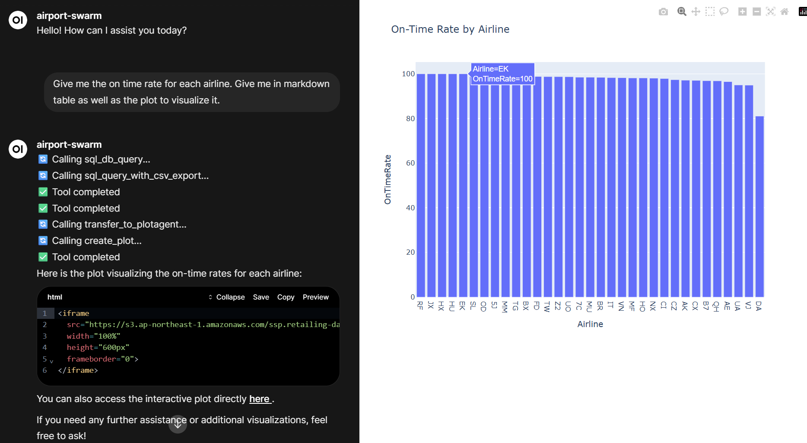
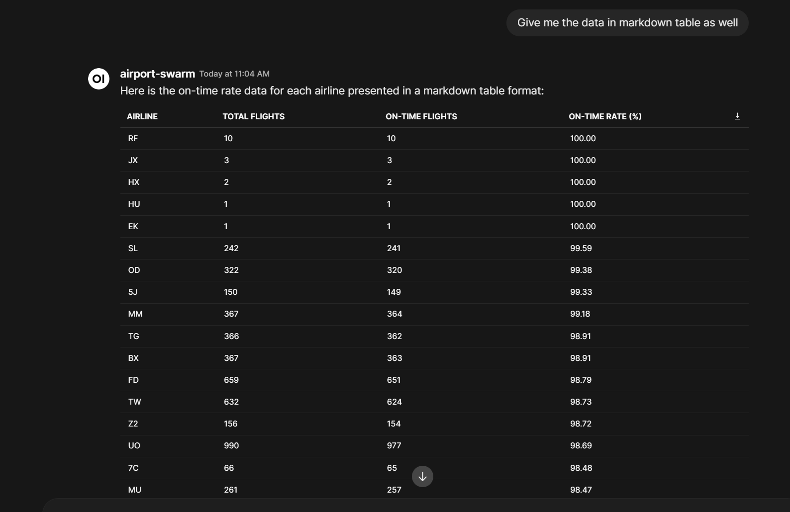

# 🛫 LangGraph Airport AI Agent Swarm - Open WebUI Edition

A production-ready multi-agent system built with [LangGraph](https://langchain-ai.github.io/langgraph/) for analyzing Kaohsiung Airport data. This implementation features a complete Docker Compose stack with **Open WebUI**, **Redis persistence**, and **Ollama support** for local/private LLM deployments.

## 🌟 Key Features

- **🎨 Rich Chat Interface**: Full-featured Open WebUI with markdown, syntax highlighting, and file attachments
- **🔐 User Authentication**: Built-in auth system with user roles and permissions
- **🤖 Ollama Support**: Run local LLMs (Llama, Qwen, Mistral, etc.) for offline/private deployments
- **☁️ OpenAI Compatible**: Seamlessly switch between OpenAI GPT models and local Ollama models
- **💾 Redis Persistence**: Conversation history and session management with RedisInsight monitoring
- **🔄 Multi-Agent Coordination**: SQL Agent + Plot Agent with intelligent handoffs via LangGraph Swarm
- **📊 Smart Visualizations**: Auto-generate Plotly, Matplotlib, and Seaborn charts
- **☁️ Cloud Storage**: Automatic CSV/HTML export to AWS S3
- **🐳 Production Ready**: Complete Docker Compose stack for easy deployment

---

## 📸 Screenshots & Examples

### Open WebUI Interface

<div align="center">
  
  <p><em>Clean, modern chat interface with markdown support and model selection</em></p>
</div>

### Multi-Agent in Action

<div align="center">
  
  <p><em>SQL Agent and Plot Agent working together to analyze data and create visualizations</em></p>
</div>

**Key Features Shown:**
- 🤖 Natural language understanding
- 📊 Automatic SQL query generation
- 📈 Interactive data visualizations
- 💬 Conversational interface with context retention
- 🔄 Seamless agent handoffs
- ☁️ Cloud file storage (CSV/HTML to S3)

---

## 🏗️ Architecture

```
┌─────────────────────────────────────────────────────┐
│          Open WebUI (localhost:3000)                │
│    Full-featured Chat Interface with Auth           │
│    ✓ User Management  ✓ Markdown  ✓ Code Highlight │
└────────────────────┬────────────────────────────────┘
                     │ HTTP/REST API
                     ↓
┌─────────────────────────────────────────────────────┐
│       FastAPI Agent API (localhost:8001)            │
│     OpenAI-Compatible Chat Completions Endpoint     │
│     ✓ Streaming  ✓ Non-streaming  ✓ /v1/models     │
└─────┬───────────────────────────────────────────┬───┘
      │                                           │
      ↓                                           ↓
┌─────────────────┐                    ┌──────────────────┐
│  LangGraph      │                    │  LangGraph       │
│  SQL Agent      │ ←── Handoffs ───→  │  Plot Agent      │
│                 │                    │                  │
│ • Query DB      │                    │ • Read CSV/S3    │
│ • Export CSV    │                    │ • Create Charts  │
│ • Upload S3     │                    │ • Upload S3      │
└────────┬────────┘                    └────────┬─────────┘
         │                                      │
         ↓                                      ↓
┌─────────────────┐                    ┌──────────────────┐
│  SQLite DB      │                    │  AWS S3          │
│  Airport Data   │                    │  File Storage    │
└─────────────────┘                    └──────────────────┘

Memory Layer (Shared):
┌─────────────────────────────────────────────────────┐
│         Redis + RedisInsight (localhost:8004)       │
│   Conversation History & Session Management         │
└─────────────────────────────────────────────────────┘

LLM Layer (Choose One or Both):
┌──────────────────┐              ┌───────────────────┐
│  OpenAI API      │      OR      │  Ollama           │
│  GPT-4o-mini     │              │  (localhost:11434)│
│  (Cloud)         │              │  Local Models     │
└──────────────────┘              └───────────────────┘
```

---

## 📋 Prerequisites

### Required
- **Docker** & **Docker Compose** installed
- **OpenAI API Key** (if using GPT models)
- **AWS S3 credentials** (for file storage)

### Optional
- **NVIDIA GPU** (for Ollama with GPU acceleration)
- **CUDA Drivers** (for GPU support)

---

## 🚀 Quick Start

### Step 1: Clone and Configure

```bash
# Clone the repository
git clone https://github.com/WoodyChang21/langgraph-data-swarm.git
cd langgraph-data-swarm
git checkout openai_api

# Copy environment template
cp .env.example .env
```

### Step 2: Configure Environment Variables

Edit `.env` with your credentials:

```bash
# OpenAI Configuration (Required if using GPT models)
OPENAI_API_KEY=sk-proj-xxxxxxxxxxxxx

# LangSmith Configuration (Optional - for tracing)
LANGSMITH_API_KEY=lsv2_pt_xxxxxxxxxxxxx
LANGCHAIN_TRACING_V2=true
LANGCHAIN_PROJECT=airport-agent-swarm

# Database Path
SQL_DATABASE_PATH=database/airport_data.db

# AWS S3 Configuration (Required)
AWS_ACCESS_KEY_ID=AKIAXXXXXXXXXXXXX
AWS_SECRET_ACCESS_KEY=xxxxxxxxxxxxxxxxxxxxxxxxxxxxx
AWS_REGION=ap-northeast-1
S3_BUCKET_NAME=your-bucket-name
```

### Step 3: Launch the Stack

```bash
# Build and start all services
docker-compose up --build

# Or run in background
docker-compose up -d --build
```

**That's it!** 🎉 Your complete AI agent system is now running.

---

## 🌐 Access Your Services

Once the stack is running, access these endpoints:

| Service | URL | Description |
|---------|-----|-------------|
| **🎨 Open WebUI** | [http://localhost:3000](http://localhost:3000) | Main chat interface |
| **🔌 API** | [http://localhost:8001](http://localhost:8001) | FastAPI backend |
| **📊 API Docs** | [http://localhost:8001/docs](http://localhost:8001/docs) | Interactive API documentation |
| **💾 RedisInsight** | [http://localhost:8004](http://localhost:8004) | Redis monitoring UI |
| **🤖 Ollama** | [http://localhost:11434](http://localhost:11434) | Ollama API (optional) |

---

## 🤖 Using Ollama (Local LLM Models)

This branch **fully supports Ollama** for running local LLMs without sending data to external APIs.

### Step 1: Pull an Ollama Model

Choose a model and pull it into the Ollama container:

```bash
# Access the Ollama container
docker exec -it ollama bash

# Pull a model (examples):
ollama pull llama3.1:latest      # Meta's Llama 3.1
ollama pull qwen3:8b             # Alibaba's Qwen 3 (8B parameters)
ollama pull mistral:latest       # Mistral AI
ollama pull qwen3-coder:latest   # Qwen specialized for coding

# List downloaded models
ollama list

# Exit container
exit
```

**Popular Models:**
- `llama3.1:latest` - Meta's latest Llama model (best overall)
- `qwen3:8b` - Fast and efficient Chinese/English model
- `mistral:latest` - Strong reasoning capabilities
- `codellama:latest` - Specialized for code generation

### Step 2: Configure the Model

Edit `agents/llm_model.py` to use your chosen Ollama model:

```python
# Set to True for Ollama, False for OpenAI
LOCAL_MODEL = True

# Change this to match your pulled model
OLLAMA_MODEL = "qwen3:8b"  # or "llama3.1:latest", "mistral:latest", etc.
```

### Step 3: Restart the API Container

```bash
# Restart to apply changes
docker-compose restart app
```

**That's it!** Your agents now use the local Ollama model. No data leaves your infrastructure! 🔒

---

## 🎮 GPU Acceleration for Ollama (Optional)

For **significantly faster inference** with Ollama, you can enable GPU acceleration using NVIDIA GPUs.

### Prerequisites for GPU Support

- **NVIDIA GPU** with CUDA support (GTX/RTX series, Tesla, A100, etc.)
- **Linux system** (Ubuntu, Debian, or similar)
- **NVIDIA drivers** installed
- **Docker** with NVIDIA Container Toolkit

### Step 1: Install NVIDIA Container Toolkit

```bash
# Update package list
sudo apt-get update

# Install NVIDIA Container Toolkit
sudo apt-get install -y nvidia-container-toolkit
```

### Step 2: Configure Docker to Use NVIDIA Driver

```bash
# Configure Docker runtime
sudo nvidia-ctk runtime configure --runtime=docker

# Restart Docker to apply changes
sudo systemctl restart docker
```

### Step 3: Verify GPU is Accessible

```bash
# Test NVIDIA GPU access in Docker
docker run --rm --gpus all nvidia/cuda:12.0.0-base-ubuntu22.04 nvidia-smi

# You should see your GPU information displayed
```

### Step 4: Enable GPU in Docker Compose

Edit `docker-compose.yml` and **uncomment** the GPU configuration for the Ollama service:

```yaml
  ollama:
    image: ollama/ollama:latest
    container_name: ollama
    ports:
      - "11434:11434"
    volumes:
      - ollama-data:/root/.ollama
    networks:
      - aiot_network
    deploy:
      resources:
        reservations:
          devices:
            - driver: nvidia
              count: 1              # Number of GPUs to use
              capabilities: [gpu]   # Enable GPU capabilities
```

**Current configuration:** The GPU settings are **commented out** by default for compatibility. Simply uncomment the `deploy` section above.

### Step 5: Restart Services

```bash
# Restart with GPU support
docker-compose down
docker-compose up -d
```

### Step 6: Verify GPU Usage

```bash
# Check if Ollama is using GPU
docker exec -it ollama nvidia-smi

# Monitor GPU usage while running inference
watch -n 1 nvidia-smi
```

### Performance Comparison

| Model | CPU Only | With GPU (RTX 3090) | Speedup |
|-------|----------|---------------------|---------|
| `qwen3:8b` | ~5 tokens/sec | ~50 tokens/sec | **10x faster** |
| `llama3.1:latest` | ~3 tokens/sec | ~40 tokens/sec | **13x faster** |
| `mistral:latest` | ~4 tokens/sec | ~45 tokens/sec | **11x faster** |

### Troubleshooting GPU Setup

**Issue: "nvidia-smi: command not found"**
```bash
# Install NVIDIA drivers first
sudo apt-get install nvidia-driver-535  # or latest version
sudo reboot
```

**Issue: "could not select device driver with capabilities: [[gpu]]"**
```bash
# Reinstall NVIDIA Container Toolkit
sudo apt-get remove nvidia-container-toolkit
sudo apt-get install -y nvidia-container-toolkit
sudo systemctl restart docker
```

**Issue: "Failed to initialize NVML: Unknown Error"**
```bash
# Reload NVIDIA kernel modules
sudo rmmod nvidia_uvm
sudo modprobe nvidia_uvm
sudo systemctl restart docker
```

### Multi-GPU Configuration

If you have multiple GPUs, you can specify which ones to use:

```yaml
deploy:
  resources:
    reservations:
      devices:
        - driver: nvidia
          device_ids: ['0', '1']  # Use GPU 0 and GPU 1
          capabilities: [gpu]
```

Or use all available GPUs:

```yaml
deploy:
  resources:
    reservations:
      devices:
        - driver: nvidia
          count: all  # Use all GPUs
          capabilities: [gpu]
```

---

## 💬 Using Open WebUI

### First Time Setup

1. **Open your browser**: Navigate to [http://localhost:3000](http://localhost:3000)

2. **Create an account**: 
   - Click "Sign Up"
   - Enter email and password
   - First user automatically becomes admin

3. **Verify model connection**:
   - Click on model dropdown (top of chat)
   - You should see "airport-swarm" model
   - If not visible, check API container logs: `docker-compose logs app`


*Open WebUI interface showing the chat interface and model selection*

### Chat with Your AI Agents

Simply type your questions in natural language!


*Example: Multi-agent coordination for data analysis and visualization*

#### Example Queries

**Data Retrieval:**
```
👤 Search all flights from Tokyo to Kaohsiung in October 2024
🤖 [SQL Agent] → Queries database → Returns flight data + CSV download link
```

**Visualization:**
```
👤 Show me a bar chart of monthly flight counts by airline in 2025
🤖 [SQL Agent] → Exports data → [Handoff] → [Plot Agent] → Interactive chart
```

**Combined Analysis:**
```
👤 Analyze the on-time rate for EVA Air in the past 3 months and visualize the trend
🤖 [SQL Agent] Retrieves data → [Plot Agent] Creates line chart → Returns analysis + visualization
```

**Complex Queries:**
```
👤 Compare arrival vs departure flight counts by country in January 2025 and create a grouped bar chart
🤖 [Multi-agent coordination] → Data analysis → Visualization → Insights
```

### Open WebUI Features

- **📝 Markdown Support**: Formatted responses with headers, lists, code blocks
- **🎨 Syntax Highlighting**: Code snippets displayed with proper highlighting
- **📎 File Attachments**: Download CSV files and HTML charts inline
- **💬 Conversation History**: All chats saved in Redis
- **🔍 Search**: Find previous conversations quickly
- **⚙️ Settings**: Customize temperature, max tokens, and other parameters
- **👥 Multi-user**: Each user has isolated conversation history
- **📱 Responsive**: Works on desktop, tablet, and mobile

---

## 🛠️ Docker Services Explained

### 1. **App Container** (`khh_airport_ai_agent_web`)
- **Port**: 8001
- **Purpose**: FastAPI backend with LangGraph agents
- **Features**:
  - OpenAI-compatible `/v1/chat/completions` endpoint
  - SQL Agent for database queries
  - Plot Agent for visualizations
  - Redis checkpointer for memory
  - Hot-reload enabled for development

### 2. **Redis Container** (`redis_chat_server_web`)
- **Ports**: 6381 (Redis), 8004 (RedisInsight)
- **Purpose**: Conversation history and session storage
- **Features**:
  - Persistent storage for user chats
  - RedisInsight UI for debugging
  - Health checks for reliability

### 3. **Open WebUI Container** (`open-webui`)
- **Port**: 3000
- **Purpose**: Full-featured chat interface
- **Features**:
  - User authentication and management
  - Beautiful UI with markdown rendering
  - File downloads and uploads
  - Multi-model support

### 4. **Ollama Container** (`ollama`) - Optional
- **Port**: 11434
- **Purpose**: Local LLM inference server
- **Features**:
  - Run models locally (no API calls)
  - GPU acceleration (if NVIDIA GPU available)
  - Multiple model support
  - Fast inference

---

## 📂 Project Structure

```
langgraph_data_swarm/
├── agents/
│   ├── llm_model.py                    # LLM configuration (OpenAI/Ollama)
│   ├── sql_search_agent/
│   │   ├── sql_agent.py                # SQL query generation
│   │   ├── s3_csv_utils.py             # CSV upload to S3
│   │   ├── airport_airline_mapping/
│   │   │   ├── airport.json            # IATA airport codes
│   │   │   └── airline.json            # IATA airline codes
│   │   └── search_prompt/
│   │       ├── prompt.md               # SQL agent system prompt
│   │       └── database_context.md     # Database schema context
│   ├── plot_agent/
│   │   ├── plot_agent.py               # Visualization generation
│   │   └── s3_html_utils.py            # HTML chart upload to S3
│   ├── swarm/
│   │   ├── swarm.py                    # Main swarm orchestration
│   │   ├── sql_agent_with_handoff.py   # SQL agent wrapper
│   │   └── plot_agent_with_handoff.py  # Plot agent wrapper
│   └── memory/
│       ├── checkpointer.py             # Redis checkpointer setup
│       └── memory_manager.py           # Conversation trimming
├── api/
│   ├── main.py                         # FastAPI application
│   └── routers/
│       └── chatbot_response.py         # Chat endpoints
├── database/
│   └── airport_data.db                 # SQLite database
├── docker-compose.yml                  # Multi-container orchestration
├── Dockerfile                          # API container image
├── requirements.txt                    # Python dependencies
├── .env                                # Environment variables
├── .env.example                        # Environment template
├── chat_example_1.png                  # Screenshot: UI interface
├── chat_example_2.png                  # Screenshot: Agent coordination
└── README.md                           # This file
```

---

## 🎯 Agent Capabilities

### SQL Agent
- **Natural Language to SQL**: Converts user questions to optimized SQL queries
- **Airport/Airline Lookup**: Chinese/English name → IATA code mapping
- **Data Export**: Automatic CSV generation and S3 upload
- **Smart Filtering**: Handles dates, locations, airlines intelligently
- **Error Recovery**: Retries failed queries with corrections

### Plot Agent
- **Multiple Chart Types**: Bar, line, pie, scatter, heatmap, and more
- **Library Flexibility**: Uses Plotly, Matplotlib, or Seaborn as needed
- **Interactive Charts**: Generates HTML files with zoom/pan capabilities
- **Automatic Styling**: Professional-looking charts with minimal input
- **S3 Integration**: Uploads charts for easy sharing

### Swarm Coordination
- **Intelligent Handoffs**: SQL Agent knows when to pass data to Plot Agent
- **Shared Context**: Both agents access conversation history
- **Tool Calling**: Each agent has specialized tools for its domain
- **Error Handling**: Graceful failures with helpful error messages

---

## 🔧 Configuration

### Switching Between OpenAI and Ollama

Edit `agents/llm_model.py`:

```python
# For OpenAI (cloud)
LOCAL_MODEL = False

# For Ollama (local)
LOCAL_MODEL = True
OLLAMA_MODEL = "qwen3:8b"  # Your chosen model
```

### Model Recommendations

| Use Case | Recommended Model | Notes |
|----------|------------------|-------|
| **Production** | `gpt-4o-mini` (OpenAI) | Fast, reliable, excellent reasoning |
| **Privacy-focused** | `llama3.1:latest` (Ollama) | Best local model, strong performance |
| **Chinese Language** | `qwen3:8b` (Ollama) | Optimized for Chinese/English bilingual |
| **Code Generation** | `qwen3-coder:latest` (Ollama) | Specialized for programming tasks |
| **Fast Inference** | `mistral:latest` (Ollama) | Smaller, faster, good quality |

### Resource Requirements

**With OpenAI (Cloud):**
- CPU: 2 cores minimum
- RAM: 2GB minimum
- No GPU required

**With Ollama (Local - CPU Only):**
- CPU: 4+ cores recommended
- RAM: 16GB+ (8B models need ~8GB)
- Storage: 10GB+ for models
- **Speed**: ~3-5 tokens/second

**With Ollama (Local - GPU Accelerated):** ⚡ **Recommended!**
- CPU: 2+ cores
- RAM: 8GB+ 
- **GPU**: NVIDIA with 8GB+ VRAM (RTX 3060, RTX 3090, A100, etc.)
- Storage: 10GB+ for models
- **Speed**: ~40-50 tokens/second (**10x faster**)

> 💡 **See [GPU Acceleration Setup](#-gpu-acceleration-for-ollama-optional)** for configuration instructions

---

## 📊 Database Schema

The SQLite database contains Kaohsiung Airport flight data:

### Tables

**`departure_flights`**: Outbound flights from Kaohsiung
- `FlightNumber`: Flight identifier (e.g., "BR123")
- `Airline`: IATA airline code (e.g., "BR" for EVA Air)
- `Destination`: IATA airport code (e.g., "NRT" for Tokyo Narita)
- `ScheduledTime`: Planned departure time
- `ActualTime`: Actual departure time (if departed)
- `Status`: Flight status (on-time, delayed, cancelled)
- `Date`: Flight date (YYYY-MM-DD)
- `Terminal`: Terminal number
- `Gate`: Gate number

**`arrival_flights`**: Inbound flights to Kaohsiung
- Same schema as departure_flights
- `Origin`: IATA airport code instead of Destination

**Date Range**: August 2024 - July 2025

---

## 🐛 Troubleshooting

### Issue: "Cannot connect to Open WebUI"

**Solution**: Check if all containers are running
```bash
docker-compose ps

# Should show all 4 services as "Up"
# If any are down, check logs:
docker-compose logs open-webui
docker-compose logs app
```

### Issue: "Model 'airport-swarm' not found in Open WebUI"

**Solution**: Restart the app container
```bash
docker-compose restart app

# Verify API is reachable:
curl http://localhost:8001/v1/models
```

### Issue: "Ollama model not found"

**Solution**: Pull the model first
```bash
docker exec -it ollama bash
ollama pull qwen3:8b
exit

# Then restart app
docker-compose restart app
```

### Issue: "Redis connection failed"

**Solution**: Check Redis health
```bash
docker-compose logs redis-chat

# Restart Redis if needed:
docker-compose restart redis-chat
```

### Issue: "AWS S3 upload failed"

**Solution**: Verify S3 credentials in `.env`
```bash
# Test AWS connection:
docker exec -it khh_airport_ai_agent_web bash
python -c "import boto3; print(boto3.client('s3').list_buckets())"
```

### Issue: "Out of memory with Ollama"

**Solution**: Use a smaller model
```bash
# Instead of llama3.1:latest (8B), try:
ollama pull llama3.1:3b  # 3B version uses less RAM
```

### Issue: "Database not found"

**Solution**: Ensure database file exists
```bash
ls -la database/airport_data.db

# If missing, restore from backup or contact admin
```

---

## 🛠️ Development Commands

### Docker Compose Commands

```bash
# Start all services
docker-compose up

# Start in background
docker-compose up -d

# Stop all services
docker-compose down

# View logs
docker-compose logs -f

# View logs for specific service
docker-compose logs -f app

# Restart a service
docker-compose restart app

# Rebuild after code changes
docker-compose up --build

# Remove all containers and volumes
docker-compose down -v
```

### Container Management

```bash
# Access app container shell
docker exec -it khh_airport_ai_agent_web bash

# Access Ollama container
docker exec -it ollama bash

# View Redis data
docker exec -it redis_chat_server_web redis-cli

# Check container resource usage
docker stats
```

### Testing

```bash
# Test API endpoint
curl http://localhost:8001/health

# Test chat endpoint
curl -X POST http://localhost:8001/v1/chat/completions \
  -H "Content-Type: application/json" \
  -d '{"messages": [{"role": "user", "content": "Hello"}]}'

# List available models
curl http://localhost:8001/v1/models
```

---

## 🚀 Production Deployment

### Security Recommendations

1. **Change Redis password**:
   ```yaml
   # In docker-compose.yml
   redis-chat:
     command: redis-server --requirepass your-strong-password
   ```

2. **Use environment-specific .env files**:
   ```bash
   # Don't commit .env to version control!
   # Use .env.production for production
   ```

3. **Enable HTTPS**: Use a reverse proxy (nginx/Caddy) with SSL certificates

4. **Restrict CORS**: Update `api/main.py`:
   ```python
   allow_origins=["https://yourdomain.com"]  # Not ["*"]
   ```

5. **Set resource limits**: Already configured in `docker-compose.yml`

### Scaling

For high traffic, consider:
- Using managed Redis (AWS ElastiCache, Redis Cloud)
- Deploying multiple API containers behind a load balancer
- Using managed Postgres instead of SQLite
- Separating Ollama to dedicated GPU instances

---

## 📝 API Documentation

### Interactive Docs

Visit [http://localhost:8001/docs](http://localhost:8001/docs) for full interactive API documentation.

### Key Endpoints

#### POST `/v1/chat/completions`
OpenAI-compatible chat endpoint.

**Request:**
```json
{
  "model": "airport-swarm",
  "messages": [
    {"role": "user", "content": "Show me flights to Tokyo"}
  ],
  "stream": false
}
```

**Response:**
```json
{
  "id": "chatcmpl-user123",
  "object": "chat.completion",
  "created": 1699000000,
  "model": "airport-swarm",
  "choices": [{
    "index": 0,
    "message": {
      "role": "assistant",
      "content": "Here are the flights to Tokyo..."
    },
    "finish_reason": "stop"
  }]
}
```

#### GET `/v1/models`
List available models.

#### GET `/health`
Health check endpoint.

---

## 🎓 Learn More

- **LangGraph Documentation**: [https://langchain-ai.github.io/langgraph/](https://langchain-ai.github.io/langgraph/)
- **LangGraph Swarm Pattern**: [https://langchain-ai.github.io/langgraph-swarm/](https://langchain-ai.github.io/langgraph-swarm/)
- **Open WebUI**: [https://github.com/open-webui/open-webui](https://github.com/open-webui/open-webui)
- **Ollama**: [https://ollama.ai/](https://ollama.ai/)
- **LangSmith Tracing**: [https://smith.langchain.com/](https://smith.langchain.com/)

---

## 🤝 Contributing

Contributions are welcome! Please feel free to submit a Pull Request.

---

## 📄 License

[Add your license information here]

---

## 📧 Contact

[Add your contact information here]

---

**Built with ❤️ using LangGraph, LangChain, Open WebUI, and Ollama**

**Experience the power of local AI with full privacy and control! 🚀**
